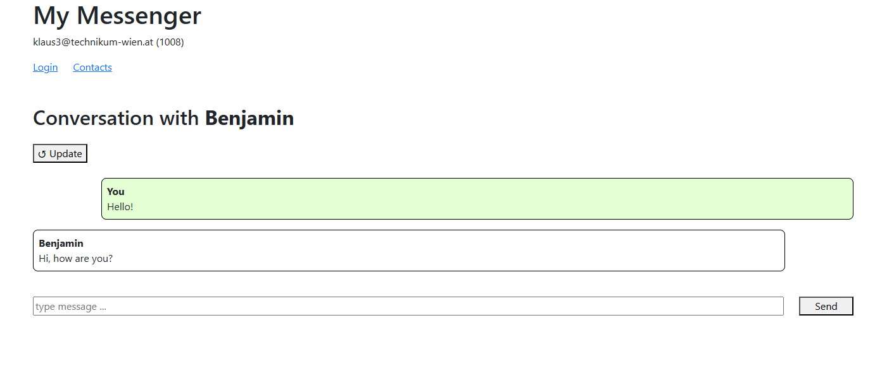
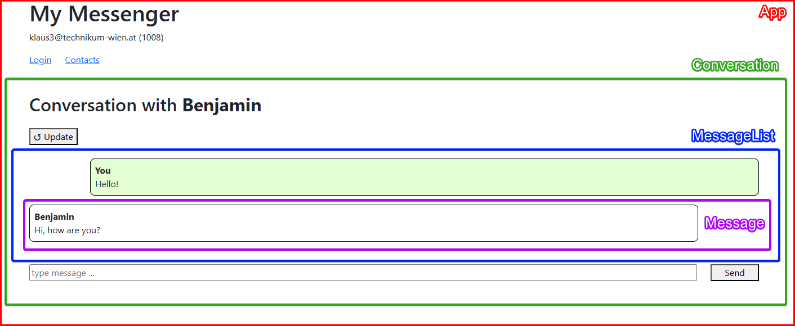
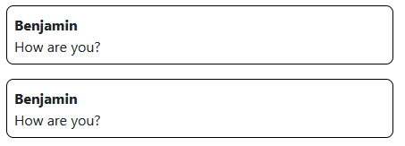

<!--
_footer: ''
_class : lead
-->

# Accessible Webtechnology - Lesson 1

Web development basics, HTML, Component-based development, Screen reader

---
## Lesson 1 Overview

- Basics of Web Development
- Component-Based Web Development
- Development with VS Code and Vue.js template

---

<!--
_footer: ''
_class : lead
-->

# Basics of Web Development

---

## What is the World Wide Web?
- a worldwide **network of computers**
- **Clients**: Browsers or devices requesting content
- **Servers**: Host content and respond to requests
- **HTTP**: used communication protocol
- **HTML**: a markup language for structuring content

**Request / Response Flow**  
`Client → Server → Client`

---

## Interaction of client and server


---

## Request and response retrieving a webpage


---

## Browser as rendering tool for webpage


---

## Local development of a web application


---

## HTML basics
HTML is a **markup language** - a well defined system for structuring text and information.
- **Tags**: reserved keywords for defined elements
   - `<h1></h1>` are tags for a heading level 1
   - tags are like brackets, `<h1>` is an opening tag, `</h1>` a closing tag
- **Content**:
   - many tags can have an **element content**
   - in `<h1>Heading</h1>` the text `Heading` is the content
- **Attributes**: tags can have additional information
   - ``
   - `src` is the attribute sof defining the image source
   - `alt` is a text describing the image


---

## HTML example

Simple example of some HTML markup:
```html
<h1>This is a heading</h1>
<p>Some text paragraph after the heading.</p>

<h2>Heading level 2</h2>
This is a list, it consists of <code>ul</code> and nested <code>li</code> elements:
<ul>
  <li>Item 1</li>
  <li>Item 2</li>
  <li>Item 3</li>
</ul>
```

---

## HTML – Content Elements

There are many elements for actual content of a website:
- `<h1>`, `<h2>`, `<h3>` etc. – Headings  
- `<p>` – Text paragraph
- `<a>` – Link ("**a**nchor")
- `` – Image  
- `<ul>`, `<ol>` - Lists (**u**nordered, **o**rdered)
- `<strong>`, `<em>` – Emphasis
- ... and many more

---

## HTML – Semantic Regions

HTML elements should be used to define important areas of a page:
- `<header>` – Top section  
- `<nav>` – Navigation menu  
- `<main>` – Main content  
- `<footer>` – Bottom info
- `<article>`, `<section>` – Structured content

<div class="box box-info">
  ℹ️ Semantic regions are <b>important for accessibility</b>! It gives non-visual users orientation on the webpage.
</div>


---

## HTML – generic containers

- `<div>` – Block-level container  
- `<span>` – Inline container

<div class="box box-warn">
  ⚠️ <strong>Attention</strong>: Use with care – prefer semantic tags when possible
</div>

---

## Try HTML for yourself

Use the online editor of **stackblitz.com** in order to try basic HTML for yourself:

<a class="bigger" href="https://t1p.de/aw-01a">t1p.de/aw-01a</a>

---

## CSS basics

**Cascading Style Sheets (CSS)** are used for **visual styling** of HTML documents.

Example of a **CSS rule**:
```css
h1 {
  background-color: yellow;
}
```

- `h1` is a **selector**, it selects to which elements the style should apply (all h1 tags)
- `background-color: yellow` is a **declaration** which defines how the selected elements should look like.
- more details in **Lecture 3**

---

## JavaScript basics

**JavaScript** is a **programming language** which can be used to **add interactivity** to a webpage.

Example of a code snippet in JavaScript:

```javascript
let fruits = ['Apple', 'Banana', 'Lemon'];
for (let fruit of fruits) {
  document.body.innerHTML += `<div>${fruit}</div>`;
}
```

This Javascript code appends a new `<div>` element for each element of an array at the end of the webpage.

More details in **Lecture 2**.

---

## Overview of HTML, CSS, JavaScript

<div class="mt-2">

| Technology | Purpose |
|------|-----------|
| **HTML** | Structure and page content |
| **CSS**  | Visual appearance |
| **JavaScript**   | Interactivity |
</div>


---

<!--
_footer: ''
_class : lead
-->

# Component-Based Web Development

---

## What is component-based web development?

- Split user interface (UI) into reusable **components**
- Improves:
  - Maintainability
  - Readability
  - Scalability
- Used in frameworks
   - **framework**: standard foundation for building software
   - examples for common web frameworks: **React, Vue.js, Angular**


---

## Example messenger app



---

## Components of example messenger app



---

## Properties of components

**Components** ...

- can **contain other components**
  - e.g. `MessageList` contains `Message` components
- can be **reused at several multiple places** within an app
   - e.g. `MessageList` component used in real conversation view and in settings for defining the style of a conversation.
- can **contain HTML, CSS and JavaScript**
   - each component has its own content, style and logic
- are normally defined in separate files, e.g. `MessageList` is defined in `MessageList.js`

---

## Define your components

Let's explore **components in practice**:

- **choose a view** (page) of your UI mockup (from lecture *UX Aspects*)
- **choose a part** where you think it could be implemented as a component
  - your part should have at least **one sub-component**
  - e.g. `MessageList` with sub-components of type `Message`
- give your components **clear, descriptive names**
- sketch a **simple mockup of your components on paper**

---

## Translate your components to HTML

Now let's think of the **HTML structure** in your components:

- take the **leaf component** (lowest level component), e.g. `Message`
- think about **fitting HTML elements** for this component, e.g. `<div>`, `<strong>`, `<p>`
- create a **HTML block representing your component**, e.g.:

<div class="columns">
   <div>
      
   </div>

   <div>

   ```html
   <!-- component "Message" -->
   <div>
      <strong>Benjamin</strong>
      <p>Hi, how are you?</p>
   </div>
   ```
   </div>
</div>

<div class="mt-2">

For now:
- use **pen and paper** or **any text editor**
- only **focus on content** (no styling via CSS)
</div>

---

## Translate your components to HTML (2)

- **go up the hierarchy** to the next component, e.g. `MessageList`
- **translate the component to HTML** and use **new HTML tags for your existing components**:

<div class="columns">

<div>

</div>

<div>

```html
<!-- component "MessageList" -->
<ol>
   <li>
      <Message/>
   </li>
   <li>
      <Message/>
   </li>
</ol>
```

</div>

</div>

---

## Translate your components to HTML (3)

- **go up the hierarchy** to the next component, e.g. `Conversation`
- **translate the component to HTML** and use **new HTML tags for your existing components**:

<div class="columns">


<div>


</div>

<div class="pt-3">

```html
<!-- component "Conversation" -->
<h2>Conversation with Benjamin</h2>
<button>↺ Update</button>
<MessageList/>
<input type="text" placeholder="type message...">
<button>Send</button>
```
</div>
</div>

---
## Critical AI usage 

Better **think for yourself** instead of trusting some AI tool:
- you'll learn more
- AI tools often fail to solve tasks which are not "standard tasks"
- our quite simple approach of defining HTML-components (without relation to a specific framework) seems to confuse AI

See [this conversation with ChatGPT](https://chatgpt.com/share/68bab87e-a020-8012-a3a7-a9ebf83ece28) as an example how AI fails to solve the task we've done within the last slides.

<div class="box box-warn">
  ⚠️ <strong>Warning</strong>: relying on AI to solve your tasks may seem efficient at first, but often ends up being more tedious than doing everything yourself.
</div>

---
## How to use AI

Tips for good use of AI:

* **ask for specific explanations** instead of general solutions
  - e.g. `When should I use a HTML div element and when a span?`
* let it **solve small portions of your task**
  - e.g. `Give me some HTML which could represent a simple message bubble including a sender name and the message content`
* **question AI's answers** and let it explain further
   - e.g. `Why did you use only divs and not other more specific HTML elements?`
* **ask for alternatives**
   - e.g. `Could I replace the divs with other HTML elements?`


---


<!--
_footer: ''
_class : lead
-->

# Development with VS Code and Vue.js template

---

<div class="columns-3-1">
<div>

## What is Visual Studio Code (VS Code)?

- open code editor from Microsoft
- helps with writing source code (e.g. HTML, CSS, JavaScript)
</div>

<div>

</div>
</div>

<div class="columns-3-1 mt-2">
<div>

## What is Vue.js?

- framework for building web applications
- can be used for **quickly building prototypes**
- is also used by **big websites and projects** (e.g. orf.at, GitLab)
</div>

<div>

</div>
</div>

---

## Web application template

<div class="box box-info">
  ℹ️ See steps in Moodle how to get and run the template (<i>Self-study 1</i>).
</div>

**Contents of the template** (`lecture_1/example_solution`):
* `components`: folder for components (e.g. Message, MessageList, ...)
* `views`: folder for views of the app (see next slide)
* `App.js`: component representing your whole app - outer wrapper of all views and components
* `router.js`: file defining which view should be shown for which URL
   - e.g. <a href="http://127.0.0.1:5500/my-chat-app/#/users"><em>http://127.0.0.1:5500/my-chat-app/#<strong>/users</strong></em></a> shows `UsersView` component
* `index.html`: actual HTML file which is rendered by your browser
   - Vue.js framework does some magic to render your components 🪄
   - details not important for now

---

## Views in web applications

A **view** of a web application is a component that **represents a whole page**.

Our messenger app example could have the following views:
* **Login**: login screen
* **Contacts**: a page showing all contacts
* **Conversation**: a page showing a single conversation
* **Settings**: a page for settings

Views are:
* normally **listed in the page navigation**
* sometimes **not listed in navigation** - e.g. "Conversation" view is only opened if a contact in "Contacts" is selected

---

## Implement your components in the template

* look at your **components** and **HTML snippets** from before (slides *Define your components* ff.)
* again start with the **leaf component** (lowest level component), e.g. `Message`
* duplicate an existing component from folder `components` and name it like your component, e.g. `Message.js`
* put your HTML in a file named like your component to folder `components`, e.g. `Message.js`
* insert your HTML to the variable `htmlTemplate` like this:

```javascript
const htmlTemplate = /*html*/`
<div>
   <strong>Benjamin</strong>
   <p>Hi, how are you?</p>
</div>
`
```
<div class="box box-info">
  ℹ️ In fact  we're adding the HTML to a JavaScript variable, which is then used by Vue.js, but we don't have do understand the details for now.
</div>


---

## Implement your components in the template (2)

* **go up the hierarchy** to the next component, e.g. `MessageList`
* create a new component in folder `components` and name it like your component, e.g. `MessageList.js`
* in `MessageList.js` again insert your HTML to the variable `htmlTemplate`

```javascript
const htmlTemplate = /*html*/`
<ol>
   <li>
      <Message/>
   </li>
   <li>
      <Message/>
   </li>
</ol>
`
```

<div class="box box-info">
  ℹ️ <b>Note</b>: we're using the <code><Message/></code> component, although it's not a real HTML element. We need to import it to our file,
</div>

---

## Implement your components in the template (3)

For using your own components within other components (e.g. `<Message>` within `MessageList.js`), we have to import it:

1. **import the component file** at the (top of the file):
```javascript
import Message from "./Message.js";
```

2. **tell Vue.js to use this component** in the template (bottom of the file):
```javascript
export default {
  template: htmlTemplate,
  components: { Message } // <- this line makes it possible to use <Message/> in the template
};
```

---

## Routing

* `App.js` contains the **basic overall structure** of your app
   * a `<header>` area with a navigation (`<nav>`) including links to your different views (pages)
   * a `<main>` area including the special element `<router-view>`
* the element `<router-view>` is a **placeholder for your views**
   * it depends on the **current navigation** which view is rendered there
   * the **navigation is linked to the current URL** (see browser's address bar)
      * e.g. part `/users` in <a href="http://127.0.0.1:5500/my-chat-app/#/users"><em>http://127.0.0.1:5500/my-chat-app/#<strong>/users</strong></em></a>

---

## Routing (2)

The file `router.js` defines a mapping between URLs and views like this:

```js
import UsersView from './views/UsersView.js';

const routes = [
  { path: '/users', component: UsersView }
];
```
<div class="box box-info">
  ℹ️ this mapping means that for URL path <code>/users</code> the component <code>UsersView</code> will be shown in <code><router-view></code>
</div>

You can **create a link** somewhere in the app which navigates to a view:
```html
<router-link to="/users">Users</router-link>
```

---

## Views and components as shown in the browser


---

<!--
_footer: ''
_class : lead
-->

# Accessibility

---

## WCAG and the POUR Framework

The **Web Content Accessibilty Guidelines (WCAG)** define these basic principles:

- **Perceivable** – users must be able to perceive information with their senses
   - e.g. alternative text of images, captions of videos,  good document structure
- **Operable** – the website must be operable for all users
   - everything must be accessible via keyboard, without mouse
- **Understandable** – everybody should be able to understand the website
   - e.g. labels for inputs, language of the webpage, understandable error-handling
- **Robust** – it should be possible to use the webpage by current and future browsers and screen-readers
   - e.g. write valid HTML code with start and end tags and valid attributes

---

## Example for good accessibility

```html
<h1>Heading</h1>
This is a list of tree elements:
<ul>
  <li>Item 1</li>
  <li>Item 2</li>
  <li>Item 3</li>
</ul>
<div>
Please provide your data:
<label for="name">Name</label>
<input id="name" type="text">
<label for="email">E-Mail</label>
<input id="email" type="email">
</div>

```

---

## Example for good accessibility explained

- using tags like `h1` for headings adds meta information - this is a heading
- using `ul` and `li` for the list also adds meta information - this is a list
- using correct `for` and `id` attributes on connects `labels` with `input` elements
   - adds meta information which label belongs to which input field.

→ For accessibility it's very important to:
- provide data about the structure of a document and it's content
- information should never be available only in a visual way (e.g. font-size and color)

---

## Screen Reader: NVDA

- Free screen reader for Windows  
- Download: [nvaccess.org](https://www.nvaccess.org)

---

## NVDA: Getting Started

### Basic Shortcuts

| Action | Key |
|--------|-----|
| Start reading | `Insert + ↓` |
| Stop reading | `Ctrl` |
| Next heading | `H` |
| Next link | `K` |
| Element list | `Insert + F7` |
| Current item | `Insert + Tab` |

> Test your sites using NVDA + Firefox