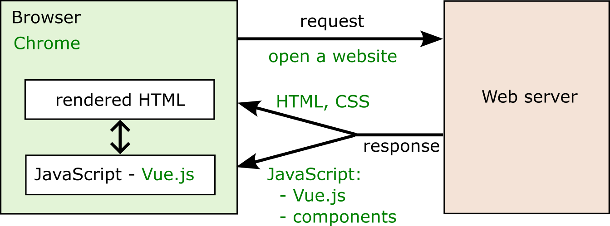

<!--
_footer: ''
_class : lead
-->

# Accessible Webtechnology - Lesson 2

JavaScript and Vue.js, Accessibility, NVDA

---
## Lesson 2 Overview

- JavaScript and Vue.js
- Accessibility
- NVDA

---

<!--
_footer: ''
_class : lead
-->

# JavaScript and Vue.js

---

## What is Vue.js?

- framework for building web applications
- can be used for **quickly building prototypes**
- is also used by **big websites and projects** (e.g. orf.at, GitLab)

<div class="mt-2">

- web applications are developed **component-based**
- Vue.js is basically a **JavaScript programm** running in the browser
- **dynamically renders HTML** based on defined components and user interaction
</div>

</div>

<div>

</div>
</div>

---

## Single-Page Application (SPA) concept



---

## Use of Vue.js for components

```js
import Message from "./Message.js";

const htmlTemplate = /*html*/`
<ol>
   <li>
      <Message/>
   </li>
   <li>
      <Message/>
   </li>
</ol>
`

export default {
  template: htmlTemplate,
  components: { Message }
};
```

Vue.js actually replaces our `<Message/>` element with the HTML defined in the `Message.js` component.

---
<!--
_footer: ''
-->

## Adding interactivity

Vue.js components (like our `Message`, `MessateList`, etc.) can made more interactive easily:

<div class="columns">
   <div>

```js
import Message from "./Message.js";

const htmlTemplate = /*html*/`
<ol>
   <li v-for="message of messages">
      <Message/>
   </li>
   <button @click="addMessage()">Add</button
</ol>
`

export default {
  template: htmlTemplate,
  components: { Message },
  data() {
   return {
      messages: ["Text 1", "Text 2", "Text 3"]
   }
  },
  methods: {
   addMessage() {
      this.messages.push("New Text");
   }
  }
};
```
   </div>
   <div>

   <div class="bigger mt-3">HTML</div>
   <div class="bigger mt-1">↕ interacts with</div>
   <div class="bigger mt-1">JavaScript</div>
   </div>
</div>


---

## Vue.js: data binding

**Data binding**: connects variables from JavaScript with HTML

<div class="columns">
   <div>
      
Vue.js definition of some data for a component:
```js
data() {
   return {
      messages: ["Text 1", "Text 2", "Text 3"]
   }
}
```
   </div>

   <div>

Usage of `messages` data within HTML template:
```html
<div>First message:</div>
<div>{{ messages[0] }}</div>

<div>All messages:</div>
<div v-for="message of messages">{{ message }}</div>
<div v-if="messages.length === 0">No messages</div>
```
   </div>
</div>

* data binding makes it **easy to render data to HTML**
* **curly braces** are used to access data, e.g. `{{ data }}`
* no curly braces needed for special functions (*directives*):
   * `v-for`: loop through arrays, e.g. `v-for="msg of messages"`, duplicates the HTML element for each array element
   * `v-if`: conditionally show something based on data

---

## Vue.js: component methods

**Component methods**: provide logic to the component using JavaScript

<div class="columns">
   <div>
      
Vue.js definition of a method in JavaScript:
```js
methods: {
   addMessage() {
      this.messages.push("New Text");
   }
}
```
   </div>

   <div>

Usage of method `addMessage()` in HTML:
```html
<ol>
   <li v-for="message of messages">
      <Message/>
   </li>
   <button @click="addMessage()">Add</button
</ol>
```
   </div>
</div>

* `@click="addMessage()"` means that the method is called if the button is clicked
* the method accesses `this.messages` which is the `messages` array defined in the component
* the same `messages` array is also used in `<li v-for="message of messages">` to create list elements (`<li>`) for each message
* adding an element with `this.messages.push("New Text")` automatically adds it as new `<li>`
* **Result**: clicking the button adds a new message to the list

---

## Vue.js basics: try for yourself

* open `lecture2/example_solution_basic` in VS Code
* start "Live Server" plugin
* examine `Demo 1: MessageList (basic)` and related code:
   * `MessageBasic.js`
   * `MessageListBasic.js`
* try to find solutions for the `TODO` comments in `MessageListBasic.js`

---

## Vue.js: component properties

* we have this hierarchy of components: `Conversation -> MessageList -> Message`
* **properties** (or *props*) can be used to **pass data to other components**

<div class="columns">
<div>

Definition of props to receive in component:
```js
// MessageList.js
export default {
  template: htmlTemplate,
  props: ["messages"] // MessageList receives prop "messages"
}
```
</div>
<div>

Usage of the component + prop in HTML:
```html
<!-- e.g. in Conversation.js -->
<MessageList :messages="messagesData"/>
```
</div>
</div>

* `:messages="..."` is the syntax to pass a prop to a component
* `:messages="messagesData"` passes the local variable `messageData` from component `Conversation` to component `MessageList`

---

## Vue.js props: try for yourself

* open `lecture2/example_solution_basic` in VS Code
* start "Live Server" plugin
* examine `Demo 2: Conversation (pass props)` and related code:
   * `Conversation.js`
   * `MessageList.js`
* try to find a solution for the `TODO` comment in `Conversation.js`

---

## Saving data in JavaScript: localStorage

* full applications mostly need databases for saving user data (outside the scope of this lecture)
* we use a **browser-internal** storage called **localStorage**
   * data persists even if the browser is closed
   * no (easy) way to transfer data to another device (e.g. log in with the same user)
   * data is stored in **key / value pairs**

Example `lecture2/example_solution_basic` contains a file `dataService.js`:
```js
import dataService from "../service/dataService.js";

// some constant to use as key for saving / retrieving data
const DATA_KEY = "DATA_KEY";

// save some data
dataService.save(DATA_KEY, "Hello"); 

// retrieve the data again
let data = dataService.get(DATA_KEY); // data now contains "Hello"

```

---

## localStorage: try for yourself

* open `lecture2/example_solution_basic` in VS Code
* start "Live Server" plugin
* examine `Demo 3: Conversation (with save)` and related code:
   * `ConversationWithSave.js`
   * `views/SettingsView.js`
* try to find solution for the `TODO` comments in these files

<div class="box box-info">
  ℹ️ see <code>lecture2/example_solution_complete</code> for a more advanced example of the chat app, which can save chats for different contacts.
</div>

---

<!--
_footer: ''
_class : lead
-->

# Accessibility

---

## WCAG and the POUR principles

The **Web Content Accessibilty Guidelines (WCAG)** define these basic principles:

- **Perceivable** – users must be able to perceive information with their senses
   - e.g. alternative text of images, captions of videos,  good document structure
- **Operable** – the website must be operable for all users
   - e.g. everything must be accessible via keyboard, without mouse
- **Understandable** – everybody should be able to understand the website
   - e.g. labels for inputs, language of the webpage, understandable error-handling
- **Robust** – it should be possible to use the webpage by all browsers and screen-readers
   - e.g. write valid HTML code complying with the current standards
---

## Example for good accessibility

```html
<nav>
   <ul>
      <li><a href="news.html">News</a></li>
      <li><a href="register.html">Register</a></li>
      <li><a href="legal.html">Legal information</a></li>
   </ul>
</nav>

<main>
   <h1>Register</h1>

   <label for="name">Name</label>
   <input id="name" type="text">

   <label for="email">E-Mail</label>
   <input id="email" type="email">

   <h2>About registration</h2>
   <p> ... some text </p>
</main>


```

---

## Example for good accessibility explained

- semantic tags for page regions help blind people to orientate, e.g. `<nav>` and `<main>`
- using tags like `<h1>`, `<ul>`, `<li>` help to categorize and understand the content
- using correct `for` and `id` attributes on connects `<label>` with `<input>` elements
   - adds meta information which label belongs to which input field

<div class="mt-2"></div>

**For accessibility it's very important to**:
- provide data about the **structure of a document** and it's content
- information should **never** be available **only in a visual way** (e.g. font-size and color)

---

## Screen Reader: NVDA

- Free screen reader for Windows  
- Download: [nvaccess.org](https://www.nvaccess.org)
- also see *Self-Study 1* in Moodle for info about other screen readers on other platforms

---

## NVDA: Basic Shortcuts

| Action | Key |
|--------|-----|
| Read next element | `Arrow down [↓]` |
| Read previous element | `Arrow up [↑]` |
| Stop reading | `Ctrl` |
| Next heading | `H` |
| Next link | `K` |
| Next landmark (region) | `D` |
| Previous [heading / link / landmark] | `Shift + [H / K / D]` |
| Change to input mode | `NVDA + Space` |
| Change speak mode (turn on/off) | `NVDA + S` (2x) |