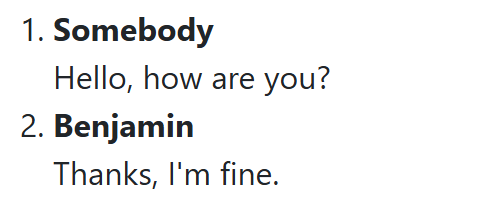
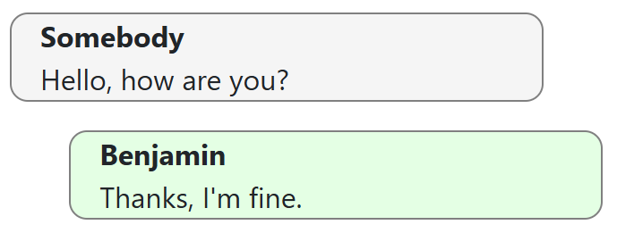
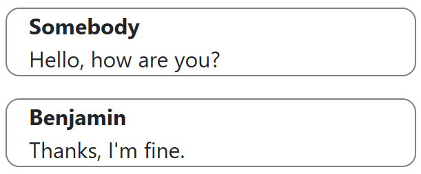
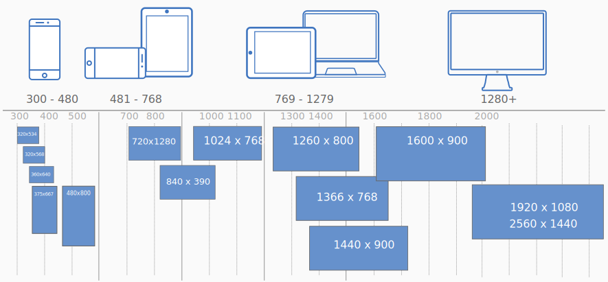
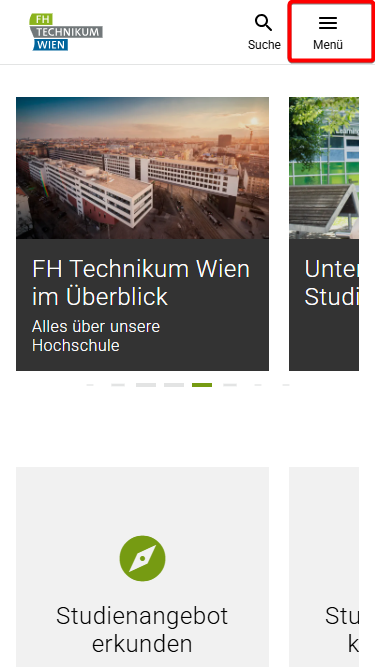
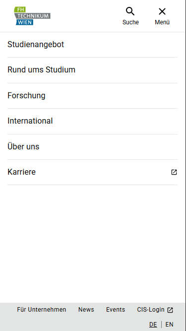
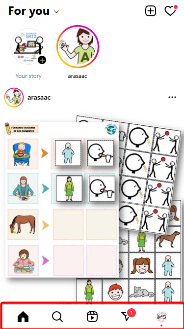
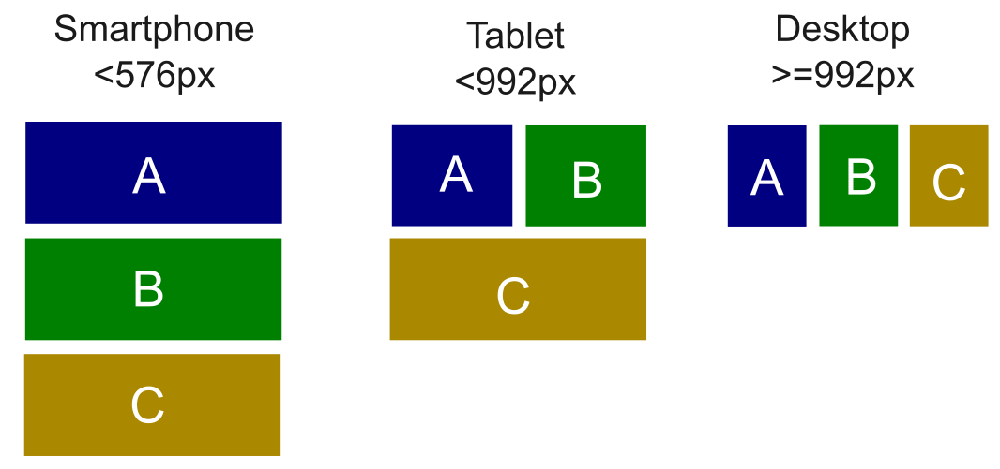
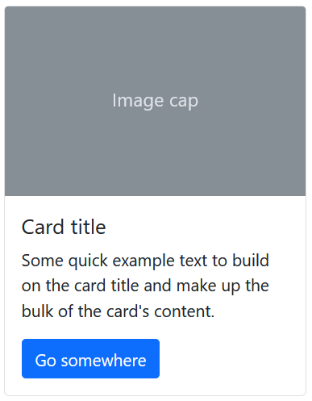
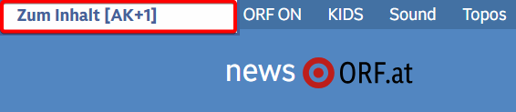

<!--
_footer: ''
_class : lead
-->

# Accessible Webtechnology - Lesson 3

CSS, Responsive Design, Bootstrap

---
## Lesson 3 Overview

- CSS
- Responsive Design
- Bootstrap

---

<!--
_footer: ''
_class : lead
-->

# Cascading Style Sheets (CSS)

---

## CSS example

Example of a **CSS rule**:
```css
h1 {
  background-color: yellow;
}
```

- `h1` is a **selector**, it selects to which elements the style should apply (all h1 tags)
- `background-color` is a **CSS property**
- `background-color: yellow` is a **declaration** which defines how the selected elements should look like.

---

## CSS basics

**Cascading Style Sheets (CSS)** are used for **visual styling** of HTML documents.

Basic general syntax of a **CSS rule**:
```css
selector, [[selector-2], ...] {
  property-1: value-1;
  ...
  property-n: value-n;
}
```

* the **selector** defines **which elements** are affected
* the **declarations** define some **visual properties** of the selected elements

---

## CSS selectors

The most important CSS selectors are:

* **element type** e.g. `h1` simply selects all `<h1>` headings
* **class**: `.class-name` selects all elements with the given `class` attribute like `<div class="class-name">`
* **ID**: `#my-id` selects the one element with this ID, e.g. `<ul id="my-id">`
* **descendant**: `div p` selects all `<p>` elements that are a descendant of a `<div>` element, e.g. `<div><p> ... </p></div>`

See a full list of possible selectors e.g. at https://en.wikipedia.org/wiki/CSS#Summary_of_selector_syntax

---

## Common CSS properties

Some common CSS properties:

* `color`: text color, e.g. `color: red` or `color: #ff0000`
* `background-color`: color of background
* `font-size`: size of font, e.g. `font-size: 14px` or `font-size: 2em`
* `width` and `height`: size of an element, e.g. `width: 100px`
* `border`: border of an element, e.g. `border: 1px solid black`
* `margin`: outside blank space next to the element, e.g. `margin: 1em` or `margin-top: 1em`
* `display`: how elements should be positioned
   * `display: block`: one element per row
   * `display: inline`: elements next to each other in a row
   * `display: flex`: flexible alignment possibilities (in combination with other CSS properties)

---

## CSS: try it for yourself

Use the online editor of **stackblitz.com** in order to try basic CSS for yourself:

<a class="bigger" href="https://t1p.de/aw-03">t1p.de/aw-03</a>

<div class="box box-info">
  ℹ️ <strong>Info</strong>: You can also open <code>lecture_3/lecture_examples/3_css/index.html</code> in VS Code and use the "Live Server" plugin for showing it in the browser (see <em>Self-study - preparations</em>).
</div>

---

## Style components

Let's improve the style of our `MessageList` component.

<div class="columns mt-2">
   <div>
      We have:
      
   </div>

   <div>
      We want:
      
   </div>
</div>


HMTL: 
```html
<div>
   <strong>{{ message.sender }}</strong>
   <div>{{ message.text }}</div>
</div>
```

---

## Styling step-by-step (1)

**Step 1**: make elements selectable via CSS

<div class="big">

```html
<div id="message-1" class="message">
   <strong>{{ message.sender }}</strong>
   <div>{{ message.text }}</div>
</div>
```

```css
#message-1 {
  /* some styles - selection by ID*/
}

.message {
  /* some styles - selection by class*/
}
```
<div>

---

## Styling step-by-step (2)

**Step 2**: add CSS declarations

<div class="medium">

```html
<div class="message">
   <strong>{{ message.sender }}</strong>
   <div>{{ message.text }}</div>
</div>
```

```css
.message {
  border: 1px solid gray;
  margin-top: 1em;
  border-radius: 10px; /* roundness of borders */
  padding-left: 1em;
  width: 90%;
}

ol {
  list-style-type: none; /* no "1. 2. 3." in list */
}
```
<div>

---

## Style components - intermediate result

<div class="columns mt-4">
   <div>
      We now have:
      
   </div>

   <div>
      We want:
      
   </div>
</div>

---

## Styling step-by-step (3)

**Step 3**: differentiate between senders


```html
<div :class="getClass()">
   <strong>{{ message.sender }}</strong>
   <div>{{ message.text }}</div>
</div>
```

```js
getClass() {
  return this.message.sender === "Benjamin" ? "message own-message" : "message other-message";
}
```

```css
.own-message {
    margin-left: 10%;
    background-color: rgb(228, 255, 228);
}

.other-message {
    background-color: whitesmoke;
}
```

---


<!--
_footer: ''
_class : lead
-->

# Responsive Design

---

## Responsive design - screen sizes



---

## Website (desktop) - navigation bar


---

## Website (mobile) - burger menu

<div class="d-flex">


</div>


----

## Mobile app - bottom navigation bar



---

## Responsive design - in your app

* **Responsive design**: modern websites are designed to **dynamically change the design** depending on the **screen size**
* UI Frameworks are a great help, e.g. *Bootstrap*, see https://getbootstrap.com/

<div class="mt-2">

Proper responsive design is **beyond the scope of this lecture**. Do this for your project:
* select **one screen size** (desktop or mobile)
* select **one menu style** (see last slides)
* base your design on these decisions
* see examples for different menus in `lecture_3/example_solution`
   * `indexNavbar.html`: example of a functional navbar menu (mobile and desktop)
   * `indexBottomNav.html`: example of a functional bottom navigation menu (mobile)

<div>

---

<!--
_footer: ''
_class : lead
-->

# Bootstrap

---

## Responsive design with bootstrap



See bootstrap Grid system documentation: https://getbootstrap.com/docs/5.0/layout/grid/

---

## Bootstrap components

Bootstrap offers predefined components, which can be used, e.g. *Card*.

<div class="columns mt-2">
<div>
HTML:

<div class="big">

```html
<div class="card">
  
  <div class="card-body">
    <h5 class="card-title">Card title</h5>
    <p class="card-text"> Text ... </p>
    <a href="#" class="btn btn-primary">Go ...</a>
  </div>
</div>
```
</div>
</div>

   <div>
      
   </div>
</div>

See bootstrap component docs: https://getbootstrap.com/docs/5.0/components/card/

---

## Bootstrap helpers

There are **helper classes** in bootstrap which can be useful to use, e.g. for spacing:

* `m`: margin, e.g. `m-1`, `m-2`, ... for spacing around the element
* `mt`: margin-top, e.g. `mt-1`, `mt-2`, ...
* `mr`: margin-right
* `mb`: margin-bottom
* `ml`: margin-left

* `p`: padding, e.g. `p-1`, `p-2`, ... for spacing within the element (to the border)
* `pt`, `pr`, `pb`, `pl` ... like for margin

See docs: https://getbootstrap.com/docs/5.0/utilities/spacing/

---

## Bootstrap - screenreader only

For accessibility sometimes its helpful to have some code **only visible for screenreaders**, not for sighted users.

Bootstrap offers the classes `visually-hidden` and `visually-hidden-focusable` for that purpose.

<div class="medium">

```html
<h2 class="visually-hidden">Title for screen readers</h2>
<a class="visually-hidden-focusable" href="#content">Skip to main content</a>
```
</div>

Try to press `Tab` key on websites and you'll sometimes find these *skip links*:


See docs: https://getbootstrap.com/docs/5.0/helpers/visually-hidden/